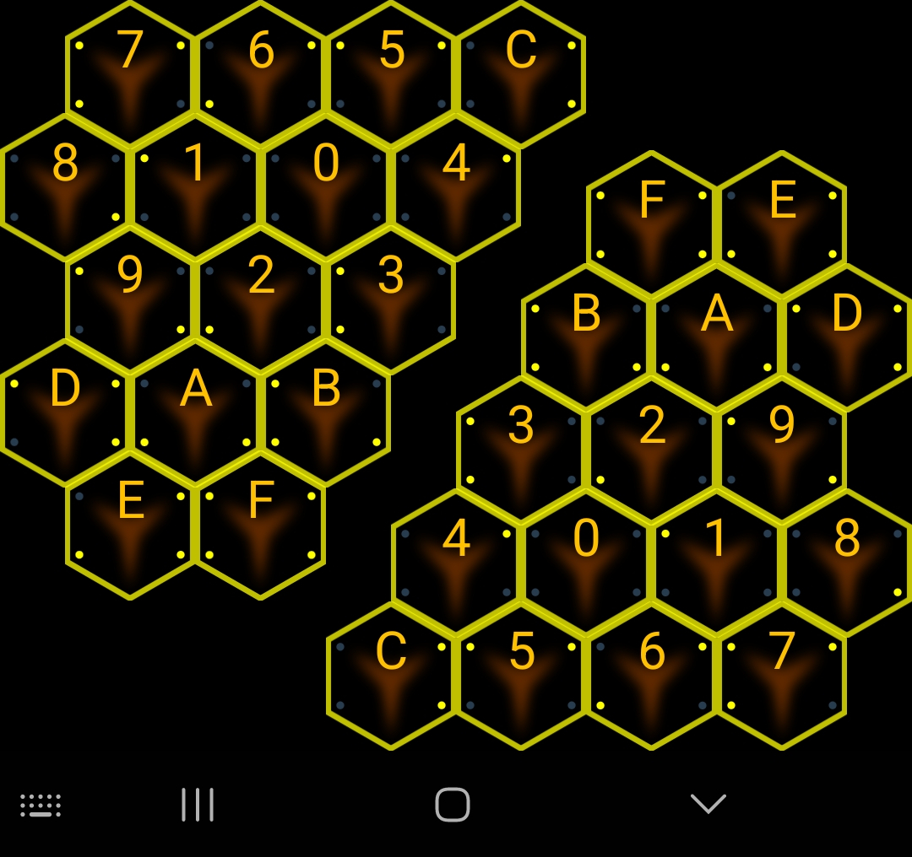
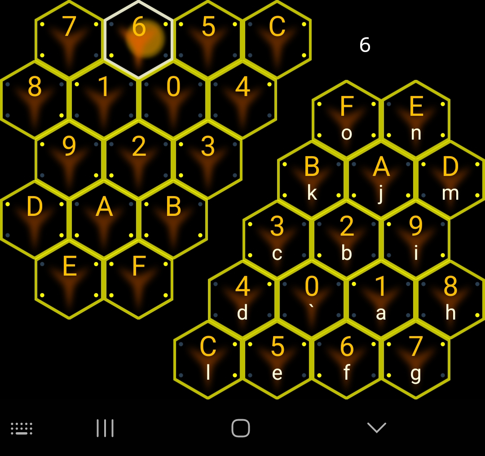
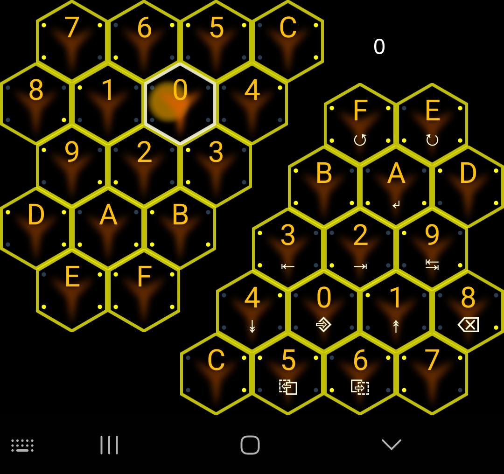

# HexadecK

This is a prototype of the HexadecK, a virtual hexadecimal keyboard for Android. Enter character
codes in hexadecimal micro-chords to type more characters with fewer keys. The project can be built
and deployed with Android Studio.

## How to use

This keyboard has a split layout, and to type a character/command, you must press two 
hexadecimal keys. The two keys combined specify 16 bits of data, enough for one ASCII character 
(and some unicode). You can either press one in the left group first and then one in the right
group, or you can press them both at the same time. You can also never raise your finger from the
left group and just slide it from key to key, tapping a key in the right group to type a character.

In the screenshot below, the 6 was pressed in the left group. Now pressing a key in the right 
group would type the character displayed on it in white:

Currently this only supports the first 256 characters of unicode. In addition, most of the 
characters in the first 32 unicode/ASCII characters are control characters that most programs 
discard. Some of these codes have been replaced with useful commands, others send the signal for 
their action rather than the raw character (such as backspace).

### commands and codes
- 0x00 = submit/go (often enter, sometimes newline)
- 0x01 = page up
- 0x02 = page end
- 0x03 = page home
- 0x04 = page down
- 0x05 = copy
- 0x06 = paste
- 0x08 = backspace
- 0x09 = tab
- 0x0A = newline
- 0x0E = redo
- 0x0F = undo

- 0x10 = select all
- 0x11 = up
- 0x12 = right
- 0x13 = left
- 0x14 = down
- 0x1B = escape
- 0x1E = forward
- 0x1F = back

- 0x20 = space
- 0x7F = delete
 
## Future

This keyboard is usable, with much practice. The peak typing test speed I've seen is 43 WPM. But it 
could be made much better. Ideas for improvements are tracked as issues with the enhancement tag.
