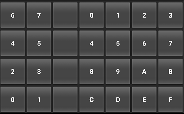

# HexadecK

This is a prototype of the HexadecK, a virtual hexadecimal keyboard for Android. Enter character
codes in hexadecimal micro-chords to type more characters with fewer keys.

The project can be built and deployed with Android Studio. The current implementation does not
support simultaneous key-presses, so the first hexadecimal code must be entered on the left and then
the second on the right. The current implementation is also portrait only.

## Known issues

This is a super early prototype. Most of it is terrible. Please don't bother to critique the key
layout of minor bugs as I already plan to change all of it. The most interesting thing right now is
the concept of micro-chording two hexadecimal keys to construct a key code in ASCII (or eventually
extended ASCII or unicode). In spite of all of the issues and shortcomings, I've achieved a 
reasonable typing speed with this keyboard. Along the way I've noticed and gotten used to coping 
with a couple of significant issues.

- If two keys are pressed simultaneously, usually one will not be detected.
- Backspace and newline do not work correctly in some applications.
